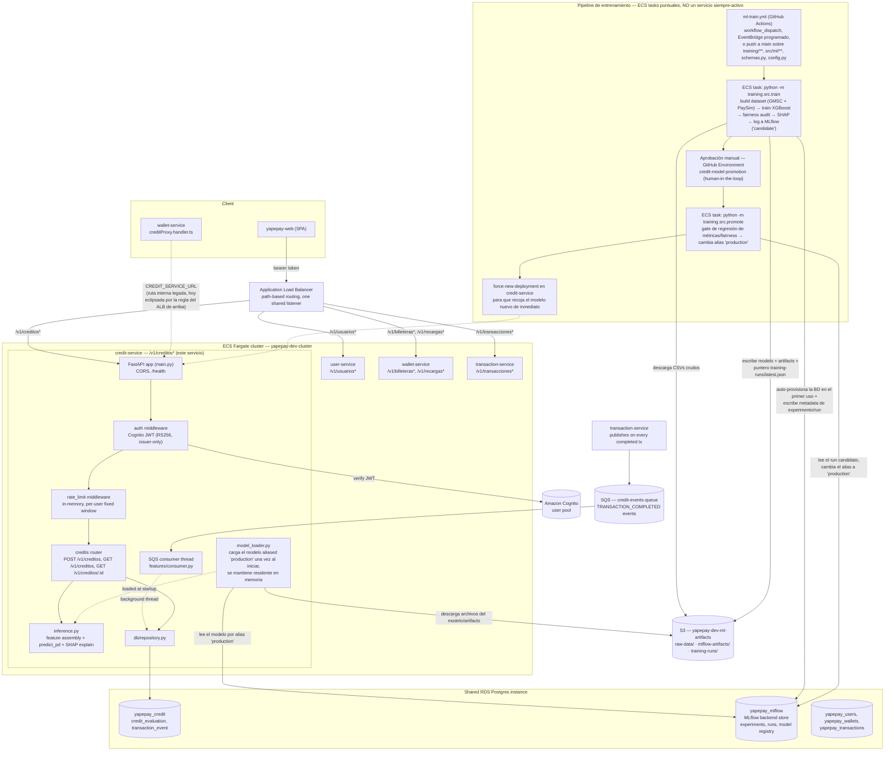
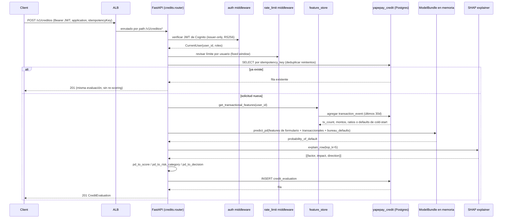

# YapePay Services

Backend de **YapePay** — plataforma de pagos digitales P2P. Arquitectura de microservicios sobre AWS ECS Fargate + Lambda, con contrato de API generado desde modelos Smithy.

## Repositorios relacionados

| Repo | Descripción |
|------|-------------|
| [yapepay-smithy](https://github.com/jhonaumss/yapepay-smithy) | Modelos Smithy — fuente de verdad del contrato API |
| yapepay-services | Microservicios (este repo) |
| [yapepay-infra](https://github.com/jhonaumss/yapepay-infra) | Infraestructura AWS CDK |

---

## Base URL (AWS — ambiente dev)

```
http://yapepay-dev-alb-717626426.us-east-1.elb.amazonaws.com
```

Todos los endpoints de usuario requieren autenticación:
```
Authorization: Bearer <access_token>
```

---

## Arquitectura

```
Cliente
  │
  ▼
ALB  yapepay-dev-alb-717626426.us-east-1.elb.amazonaws.com
  ├── /v1/usuarios*      → user-service         (ECS Fargate, puerto 3000)
  ├── /v1/billeteras*    → wallet-service        (ECS Fargate, puerto 3000)
  ├── /v1/recargas*      → wallet-service        (ECS Fargate, puerto 3000)
  ├── /v1/transacciones* → transaction-service   (ECS Fargate, puerto 3000)
  ├── /v1/creditos*      → credit-service        (ECS Fargate, puerto 8000 — Python/FastAPI + XGBoost)
  └── /v1/qr*            → qr-handler            (Lambda Node.js 22 ARM64)

Comunicación interna (a través del mismo ALB):
  transaction-service ──► wallet-service    (débito / crédito)
  transaction-service ──► user-service      (lookup por teléfono)
  transaction-service ──► qr-service        (reclamar QR)
  transaction-service ──► SQS              (eventos de notificación)
  transaction-service ──► SQS credit-events-queue → credit-service (feature store de comportamiento transaccional)
  user-service        ──► wallet-service    (crear billetera al registrar)
  SQS ──► notification-handler (Lambda)    (procesar notificaciones)

Almacenamiento:
  RDS PostgreSQL (instancia compartida):
    yapepay_users · yapepay_wallets · yapepay_transactions · yapepay_qr · yapepay_credit · yapepay_mlflow

  S3 (yapepay-dev-ml-artifacts) — exclusivo de credit-service:
    raw-data/ · mlflow-artifacts/ · training-runs/

Identidad:
  AWS Cognito User Pool — autenticación y emisión de JWT

Secretos:
  AWS Secrets Manager — credenciales de base de datos (leídas en arranque)
```

---

## API Reference

### user-service — Usuarios y autenticación

| Método | Ruta | Auth | Descripción |
|--------|------|------|-------------|
| POST | `/v1/usuarios/registro` | ❌ | Registrar nuevo usuario |
| POST | `/v1/usuarios/login` | ❌ | Iniciar sesión (Cognito) |
| GET | `/v1/usuarios/me` | ✅ | Obtener perfil propio |
| PATCH | `/v1/usuarios/me` | ✅ | Actualizar nombre o email |
| GET | `/v1/usuarios/portelefono?numero=` | ❌ interno | Buscar usuario por teléfono |

### wallet-service — Billeteras y recargas

| Método | Ruta | Auth | Descripción |
|--------|------|------|-------------|
| GET | `/v1/billeteras/me` | ✅ | Consultar saldo propio |
| POST | `/v1/recargas` | ✅ | Recargar billetera |
| POST | `/v1/billeteras` | ❌ interno | Crear billetera (llamado por user-service) |
| POST | `/v1/billeteras/debito` | ❌ interno | Débito (llamado por transaction-service) |
| POST | `/v1/billeteras/credito` | ❌ interno | Crédito (llamado por transaction-service) |

### transaction-service — Transacciones

| Método | Ruta | Auth | Descripción |
|--------|------|------|-------------|
| POST | `/v1/transacciones` | ✅ | Transferencia P2P por número de teléfono |
| POST | `/v1/transacciones/qr` | ✅ | Pago con código QR |
| GET | `/v1/transacciones` | ✅ | Listar transacciones propias (paginado) |
| GET | `/v1/transacciones/:txId` | ✅ | Obtener transacción por ID |

### qr-service — Códigos QR (Lambda)

| Método | Ruta | Auth | Descripción |
|--------|------|------|-------------|
| POST | `/v1/qr` | ✅ | Generar QR de cobro |
| GET | `/v1/qr/:qrId` | ✅ | Consultar QR propio |
| PATCH | `/v1/qr/:qrId/use` | ❌ interno | Marcar QR como usado (llamado por transaction-service) |

### credit-service — Evaluación de crédito (ML)

| Método | Ruta | Auth | Descripción |
|--------|------|------|-------------|
| POST | `/v1/creditos` | ✅ | Enviar solicitud de crédito y obtener el resultado del scoring (idempotente) |
| GET | `/v1/creditos` | ✅ | Listar evaluaciones propias (paginado, cursor) |
| GET | `/v1/creditos/:evaluationId` | ✅ | Obtener una evaluación por ID |

---

## Guía de uso con AWS

### Registro e inicio de sesión

```bash
BASE=http://yapepay-dev-alb-717626426.us-east-1.elb.amazonaws.com

# Registrar usuario
curl -X POST $BASE/v1/usuarios/registro \
  -H "Content-Type: application/json" \
  -d '{
    "phoneNumber": "987654321",
    "fullName": "Juan Pérez",
    "email": "juan@example.com",
    "pinHash": "a665a45920422f9d417e4867efdc4fb8a04a1f3fff1fa07e998e86f7f7a27ae3"
  }'

# Iniciar sesión
curl -X POST $BASE/v1/usuarios/login \
  -H "Content-Type: application/json" \
  -d '{
    "phoneNumber": "987654321",
    "pinHash": "a665a45920422f9d417e4867efdc4fb8a04a1f3fff1fa07e998e86f7f7a27ae3"
  }'
# → { "accessToken": "eyJ...", "expiresIn": 3600, ... }

TOKEN="eyJ..."  # guardar el accessToken
```

> **PIN hash:** el campo `pinHash` es el SHA-256 hex (64 caracteres) del PIN. Se calcula en el cliente.

### Consultar saldo

```bash
curl $BASE/v1/billeteras/me \
  -H "Authorization: Bearer $TOKEN"
```

### Recargar billetera

```bash
curl -X POST $BASE/v1/recargas \
  -H "Authorization: Bearer $TOKEN" \
  -H "Content-Type: application/json" \
  -d '{
    "bankAccountId": "00000000-0000-4000-8000-000000000001",
    "amount": "100.00",
    "idempotencyKey": "00000000-0000-4000-8000-000000000002"
  }'
```

### Transferencia P2P

```bash
curl -X POST $BASE/v1/transacciones \
  -H "Authorization: Bearer $TOKEN" \
  -H "Content-Type: application/json" \
  -d '{
    "receiverPhone": "912345678",
    "amount": "50.00",
    "currency": "BOB",
    "description": "Pago alquiler",
    "idempotencyKey": "00000000-0000-4000-8000-000000000003"
  }'
```

### Pago por QR

**Paso 1 — Cobrador genera el QR:**

```bash
curl -X POST $BASE/v1/qr \
  -H "Authorization: Bearer $TOKEN_COBRADOR" \
  -H "Content-Type: application/json" \
  -d '{
    "amount": "75.00",
    "currency": "BOB",
    "description": "Servicio de diseño",
    "ttlMinutes": 15
  }'
# → { "qrCode": { "qrId": "abc12345-...", "qrData": "...", "used": false, ... } }
```

**Paso 2 — Pagador escanea y paga:**

```bash
curl -X POST $BASE/v1/transacciones/qr \
  -H "Authorization: Bearer $TOKEN_PAGADOR" \
  -H "Content-Type: application/json" \
  -d '{
    "qrId": "abc12345-...",
    "idempotencyKey": "00000000-0000-4000-8000-000000000004"
  }'
```

El QR queda marcado `used: true` — no puede reutilizarse. Un QR expirado o ya usado devuelve `409 Conflict`.

### Listar transacciones

```bash
# Todas las propias (sender o receiver), orden descendente por fecha
curl "$BASE/v1/transacciones" \
  -H "Authorization: Bearer $TOKEN"

# Con filtros
curl "$BASE/v1/transacciones?type=PAYMENT_QR&status=COMPLETED&pageSize=10" \
  -H "Authorization: Bearer $TOKEN"

# Página siguiente
curl "$BASE/v1/transacciones?cursor=<nextCursor>" \
  -H "Authorization: Bearer $TOKEN"
```

Parámetros de query:

| Parámetro | Valores | Descripción |
|-----------|---------|-------------|
| `type` | P2P_TRANSFER \| PAYMENT_QR \| RECHARGE \| REVERSAL | Filtrar por tipo |
| `status` | PENDING \| COMPLETED \| FAILED \| REVERSED | Filtrar por estado |
| `fromDate` | ISO 8601 | Desde fecha |
| `toDate` | ISO 8601 | Hasta fecha |
| `pageSize` | 1–50 | Tamaño de página (defecto: 20) |
| `cursor` | string | Token de paginación del response anterior |

### Obtener transacción

```bash
curl $BASE/v1/transacciones/<txId> \
  -H "Authorization: Bearer $TOKEN"
```

### Solicitar una evaluación de crédito

```bash
curl -X POST $BASE/v1/creditos \
  -H "Authorization: Bearer $TOKEN" \
  -H "Content-Type: application/json" \
  -d '{
    "application": {
      "age": 30,
      "educationLevel": "UNIVERSITARIO",
      "employmentStatus": "DEPENDIENTE",
      "monthlyIncome": 2000,
      "employmentYears": 3,
      "existingDebt": 500,
      "monthlyDebtPayments": 150,
      "hadPreviousDefault": false,
      "estimatedAssetsValue": 3000,
      "requestedAmount": 3000,
      "termMonths": 12,
      "purpose": "NEGOCIO"
    },
    "idempotencyKey": "00000000-0000-4000-8000-000000000005"
  }'
# → { "evaluation": { "score": 984, "probabilityOfDefault": 0.016, "riskCategory": "BAJO",
#                      "decision": "APROBADO", "userSegment": "NUEVO", "confidenceLevel": "BAJA",
#                      "explanationFactors": [...], "modelVersion": "credit-risk-model:v4", ... } }
```

```bash
# Listar evaluaciones propias
curl "$BASE/v1/creditos?pageSize=10" \
  -H "Authorization: Bearer $TOKEN"

# Obtener una evaluación por ID
curl "$BASE/v1/creditos/<evaluationId>" \
  -H "Authorization: Bearer $TOKEN"
```

---

## Contratos importantes

### Formato de montos

Todos los montos son strings con exactamente dos decimales: `"100.00"`, `"75.50"`.

### Idempotencia

`POST /transacciones`, `POST /transacciones/qr`, `POST /recargas` y `POST /creditos` exigen un campo `idempotencyKey` (UUID v4). Reenviar la misma key devuelve el resultado original sin procesar la operación (ni re-evaluar el crédito) dos veces.

### QR sin monto fijo

Si el QR se generó sin `amount`, el pago QR retorna `400` con código `QR_NO_AMOUNT`. Para pagos con monto libre, usar la transferencia P2P.

---

## credit-service — Evaluación de crédito con Machine Learning

`credit-service` es el microservicio más distinto del resto: en vez de Node.js/Express corre en **Python + FastAPI**, y en vez de ser puro CRUD, sirve un modelo **XGBoost** entrenado sobre datos reales (Kaggle "Give Me Some Credit") combinados sintéticamente con comportamiento transaccional simulado (PaySim). Es el único servicio del proyecto con su propio ciclo de vida de ML (entrenamiento, auditoría de fairness, explicabilidad y promoción de modelos), y el único que corre como Fargate task de larga duración (no request/response tipo Lambda) para mantener el modelo cargado en memoria en vez de recargarlo en cada invocación.

### Contexto del sistema



**Notas arquitectónicas clave:**

- **Es el único servicio Fargate del proyecto con ciclo de vida de ML propio.** El servicio en ejecución solo *lee* un modelo (por el alias `production`); nunca entrena. Entrenamiento/promoción corren como invocaciones puntuales de `aws ecs run-task` contra una task definition dedicada (`yapepay-dev-credit-training`).
- **Dos bases de datos lógicas, una sola instancia física de RDS.** `yapepay_credit` (datos propios del servicio) y `yapepay_mlflow` (registry/tracking de MLflow) son bases Postgres separadas en la misma RDS compartida con el resto de servicios. Ambas se auto-provisionan en la primera conexión (`src/db/migrate.py`, `training/src/mlflow_logging.py:ensure_mlflow_database`).
- **El `creditProxy.handler.ts` de `wallet-service` es código muerto hoy** — el ALB enruta `/v1/creditos*` directo a `credit-service` (ver `SERVICE_ROUTES.credit` en `infrastructure/yapepay-infra/lib/stacks/services-stack.ts`), así que la propia ruta `/v1/creditos` de wallet-service nunca se alcanza a través del ALB.

### Flujo de una solicitud — `POST /v1/creditos`



Seis campos del cuerpo de la solicitud alimentan directamente el modelo: `age`, `monthlyIncome`, `monthlyDebtPayments`, `requestedAmount`, `termMonths` y `hadPreviousDefault` (ver `src/ml/inference.py`). Los campos estilo buró que el formulario nunca recolecta (`revolving_utilization`, `times_90d_late`, ...) se rellenan con `bundle.bureau_defaults` — medianas del set de entrenamiento exportadas junto al modelo.

### Reglas de negocio sobre la predicción

El PD (probabilidad de incumplimiento) que devuelve XGBoost se traduce a score/categoría/decisión mediante reglas explícitas en `training/src/model.py` (compartidas entre entrenamiento e inferencia, para que nunca diverjan):

| Regla | Umbral | Notas |
|---|---|---|
| Score | `1000 × (1 − PD)` | 0–1000, más alto = menor riesgo |
| Riesgo BAJO | `PD < 0.10` | |
| Riesgo MEDIO | `0.10 ≤ PD < 0.30` | |
| Riesgo ALTO | `PD ≥ 0.30` | |
| Decisión APROBADO | `PD < 0.25` **y** `debt_to_income_with_new_loan < 0.50` | Ver siguiente punto |

**Gate de afordabilidad, independiente del modelo:** `requested_to_income_ratio` y `debt_to_income_with_new_loan` se sintetizan en `dataset_builder.py` *después* de que la etiqueta de GMSC ya viene fija, por lo que el modelo aprende ~cero señal real sobre ellas — no se puede confiar en que XGBoost solo rechace una solicitud desproporcionada al ingreso. Por eso `pd_to_decision` aplica un segundo corte de negocio (`config.MAX_DEBT_TO_INCOME_WITH_NEW_LOAN = 0.50`, el estándar típico de DTI en underwriting subprime) que rechaza la solicitud sin importar qué tan baja sea la PD.

**`hadPreviousDefault` (el checkbox "he tenido incumplimientos anteriormente"):** antes se recolectaba y se descartaba sin usar. Ahora, durante el entrenamiento, se deriva una señal real a partir de los atrasos reales de GMSC (`times_90d_late`, `times_60_89d_late`, `times_30_59d_late`) con una tasa de error de autoreporte del 10% (`dataset_builder.py`), y en inferencia se pasa directamente el valor declarado por el usuario — a diferencia de los demás campos de buró, este no se congela en la mediana poblacional.

### Pipeline de entrenamiento y promoción

Desacoplado del serving a propósito (el reentrenamiento nunca debe afectar la disponibilidad de inferencia):

1. **Disparo**: `ml-train.yml` corre con `workflow_dispatch` (manual), `repository_dispatch` (programado, vía `RetrainTriggerStack` en `infrastructure/yapepay-infra`), **o automáticamente con cada push a `main` que toque `credit-service/training/**`, `credit-service/src/ml/**`, `schemas.py` o `config.py`** — la mitad de CD de "reentrenar automáticamente".
2. **Entrenar**: `python -m training.src.train` corre como ECS Fargate task dentro de la VPC (necesita acceso directo a RDS, algo que un runner de GitHub no tiene). Construye el dataset desde GMSC + PaySim, entrena XGBoost, corre auditoría de fairness (paridad demográfica por rango etario / situación laboral / nivel educativo), construye el explainer SHAP, y registra todo en MLflow bajo el alias `candidate`.
3. **Aprobar**: el job `promote` exige un revisor humano vía el Environment de GitHub `credit-model-promotion` — este paso **sigue siendo obligatorio incluso cuando el entrenamiento se disparó automáticamente**, así que un push nunca empuja un modelo nuevo a producción sin intervención humana.
4. **Promover**: `python -m training.src.promote` compara al candidato contra el `roc_auc` y la brecha de fairness del modelo `production` actual (tolerancias de regresión en `promote.py`) — rechaza la promoción si empeora más allá de la tolerancia; si no, cambia el alias `production`.
5. **Reiniciar**: fuerza un nuevo deployment de `credit-service` para que el task en ejecución recoja el modelo recién promovido (`model_loader.py` lo carga una sola vez, en el startup del `lifespan`, y lo mantiene residente durante toda la vida del task).

### Almacenamiento y dependencias externas

| Store | Propósito | Provisioning |
|---|---|---|
| `yapepay_credit` (Postgres) | `credit_evaluation` (solicitudes evaluadas), `transaction_event` (log crudo del feature store) | Auto-provisionado por `src/db/migrate.py` en el arranque del contenedor |
| `yapepay_mlflow` (Postgres) | Experimentos/runs/model registry de MLflow | Auto-provisionado por `ensure_mlflow_database()` en la primera conexión de entrenamiento/serving |
| S3 `yapepay-dev-ml-artifacts` | `raw-data/` (CSVs de entrenamiento, subidos manualmente una vez), `mlflow-artifacts/` (modelo + artifacts de cada run), `training-runs/latest.json` (puntero al candidato) | Creado por `storage-stack.ts`; el contenido lo llena el training task |
| SQS `credit-events-queue` | Eventos `TRANSACTION_COMPLETED` de `transaction-service`, consumidos por el thread en background de `features/consumer.py` | Creado por `services-stack.ts` |
| Cognito user pool | Emisor de JWT para el middleware `auth` | Compartido con los servicios Node |

### Variables de entorno clave

| Variable | Usada por | Notas |
|---|---|---|
| `DB_HOST`, `DB_PORT`, `DB_NAME`, `DB_USER`, `DB_PASSWORD`, `DB_SSL` | `src/db/*` | Base de datos propia del servicio |
| `MLFLOW_DB_HOST`, `MLFLOW_DB_PORT`, `MLFLOW_DB_NAME`, `MLFLOW_DB_USER`, `MLFLOW_DB_PASSWORD` | `training/src/config.py` | Backend Postgres de MLflow — misma RDS, distinta BD lógica |
| `MLFLOW_ARTIFACT_LOCATION` | `training/src/mlflow_logging.py` | Debe ser un URI `s3://` — si no, cae a un `file://` local que no sobrevive más allá de un solo ECS task |
| `MLFLOW_MODEL_ALIAS` | `src/ml/model_loader.py` | Siempre `production` en runtime |
| `S3_DATA_BUCKET`, `S3_DATA_PREFIX` | `training/src/data_loading.py` | Dónde viven los CSVs crudos de entrenamiento |
| `SQS_QUEUE_URL` | `features/consumer.py` | `credit-events-queue` |
| `COGNITO_USER_POOL_ID` | `src/middleware/auth.py` | Validación del emisor del JWT |
| `INTERNAL_API_KEY` | Rutas internas | Secreto compartido para rutas internas |

### Archivos clave

| Archivo | Responsabilidad |
|---|---|
| `src/main.py` | App FastAPI, CORS, lifespan (carga el modelo, arranca el consumer de SQS) |
| `src/routers/credits.py` | Endpoints HTTP |
| `src/ml/model_loader.py` | Carga el modelo aliased `production` una sola vez, lo mantiene residente |
| `src/ml/inference.py` | Ensamblado de features + scoring de una sola solicitud |
| `src/db/repository.py` | Todo el SQL |
| `src/features/feature_store.py`, `src/features/consumer.py` | Agregación e ingesta de features transaccionales |
| `training/src/train.py` | Entrypoint completo de entrenamiento |
| `training/src/promote.py` | Gate de métricas/fairness + cambio de alias |
| `training/src/dataset_builder.py` | Combina GMSC + PaySim (features transaccionales, `had_previous_default`, campos sintéticos) |
| `training/src/model.py` | Parámetros de XGBoost + umbrales de negocio (score, categoría de riesgo, decisión incl. gate de afordabilidad) — compartido por entrenamiento e inferencia para que no diverjan |
| `training/src/explainability.py` | Factores de explicación por solicitud basados en SHAP |

---

## CI/CD

Los despliegues se hacen exclusivamente por GitHub Actions al hacer push a `main`. No se debe desplegar localmente.

**`cd.yml`** (todos los servicios, incluido credit-service):
1. Build y test de cada servicio (`pytest` para credit-service, `npm test` para los servicios Node)
2. Build de imagen Docker + push a ECR (`yapepay-dev-<servicio>-service:latest`)
3. `ecs update-service --force-new-deployment` por servicio

El qr-service se despliega como Lambda: build TypeScript → zip → `lambda update-function-code`.

**`ml-train.yml`** (exclusivo de credit-service, pipeline separado de `cd.yml`): entrena, audita fairness/métricas y — solo tras aprobación manual en el Environment `credit-model-promotion` — promueve un modelo nuevo a `production`. Se dispara manualmente, por EventBridge programado, o automáticamente con cada push a `main` que toque el pipeline de entrenamiento o el contrato de features del servicio. Ver la sección de credit-service arriba para el detalle completo.

---

## Stack tecnológico

| Capa | Tecnología |
|------|-----------|
| Runtime | Node.js 22 + TypeScript |
| Framework | Express 5 |
| Contrato API | Smithy 2.0 → TypeScript SSDK |
| Base de datos | PostgreSQL (AWS RDS) |
| Mensajería | AWS SQS (Standard queue) |
| Autenticación | AWS Cognito (JWT access tokens) |
| Secretos | AWS Secrets Manager |
| Cómputo (Fargate) | ECS Fargate (256 CPU / 512 MB) |
| Cómputo (Lambda) | Lambda ARM64 128 MB, Node.js 22 |
| Enrutamiento | Application Load Balancer (path-based) |

### Stack de credit-service (distinto al resto)

| Capa | Tecnología |
|------|-----------|
| Runtime | Python 3.11 |
| Framework | FastAPI |
| Modelo ML | XGBoost (clasificación binaria de PD) |
| Explicabilidad | SHAP (TreeExplainer) |
| Tracking / registry | MLflow (backend Postgres, artifacts en S3) |
| Datasets de entrenamiento | Kaggle "Give Me Some Credit" (GMSC) + PaySim |
| Cómputo (serving) | ECS Fargate (long-lived, modelo residente en memoria) |
| Cómputo (training/promotion) | ECS Fargate tasks puntuales, disparados por GitHub Actions |

---

## Estructura del repositorio

```
yapepay-services/
├── ssdk/                    # SDK generado desde Smithy (tipos compartidos)
├── user-service/            # Usuarios, autenticación Cognito
├── wallet-service/          # Billeteras, saldos, recargas
├── transaction-service/     # Transferencias P2P y pagos QR
├── credit-service/          # Scoring de crédito (Python/FastAPI + XGBoost + MLflow)
└── qr-service/              # Generación y validación de QR (Lambda)
```
