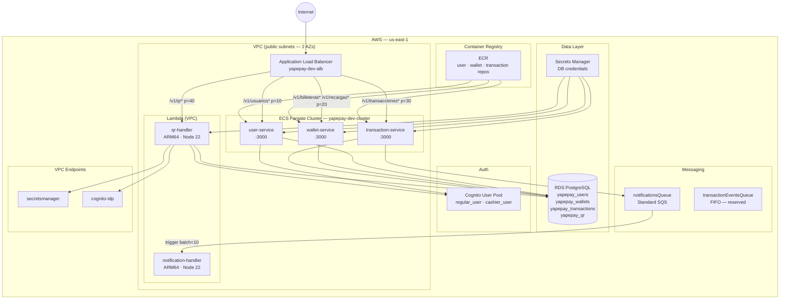
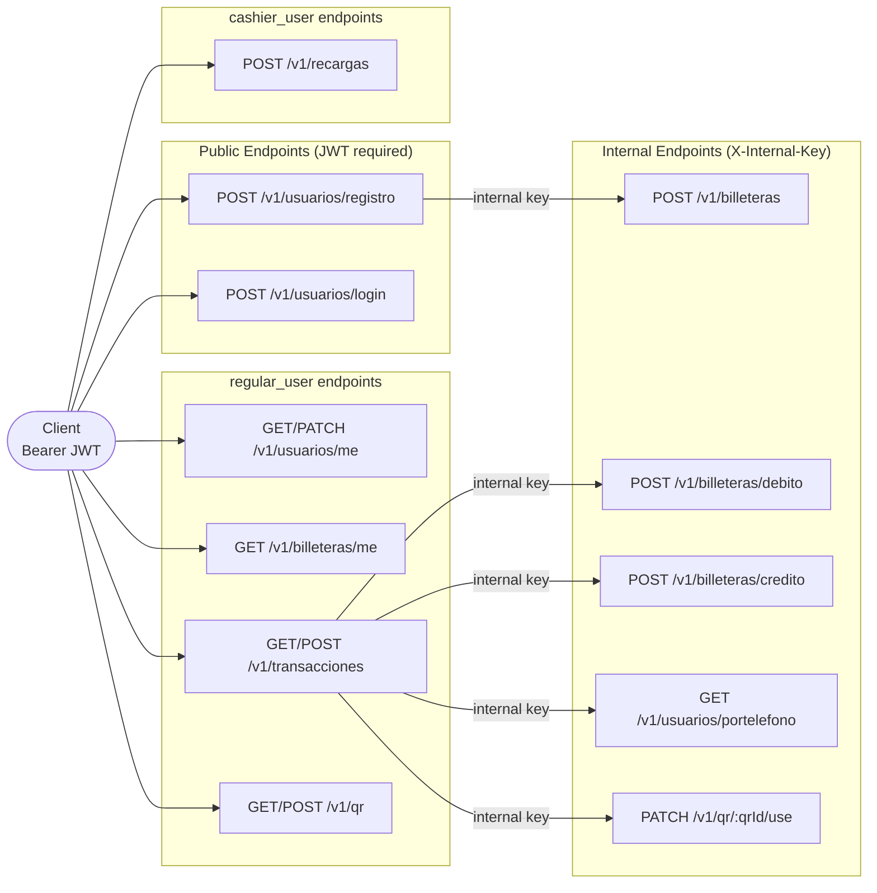
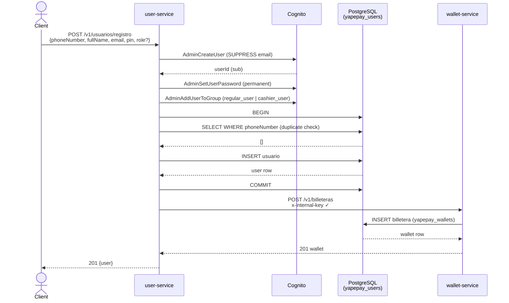
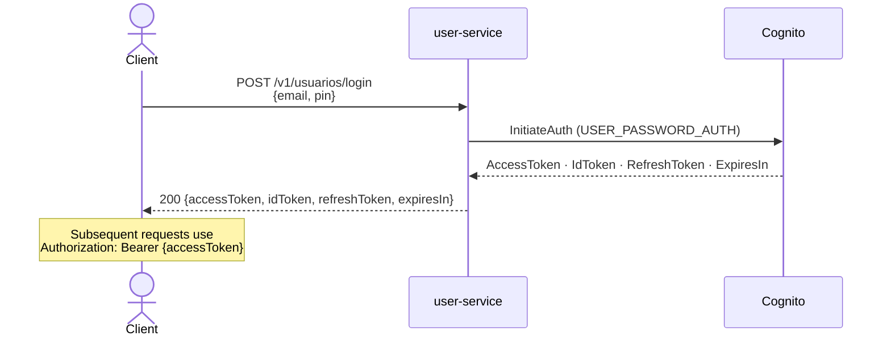
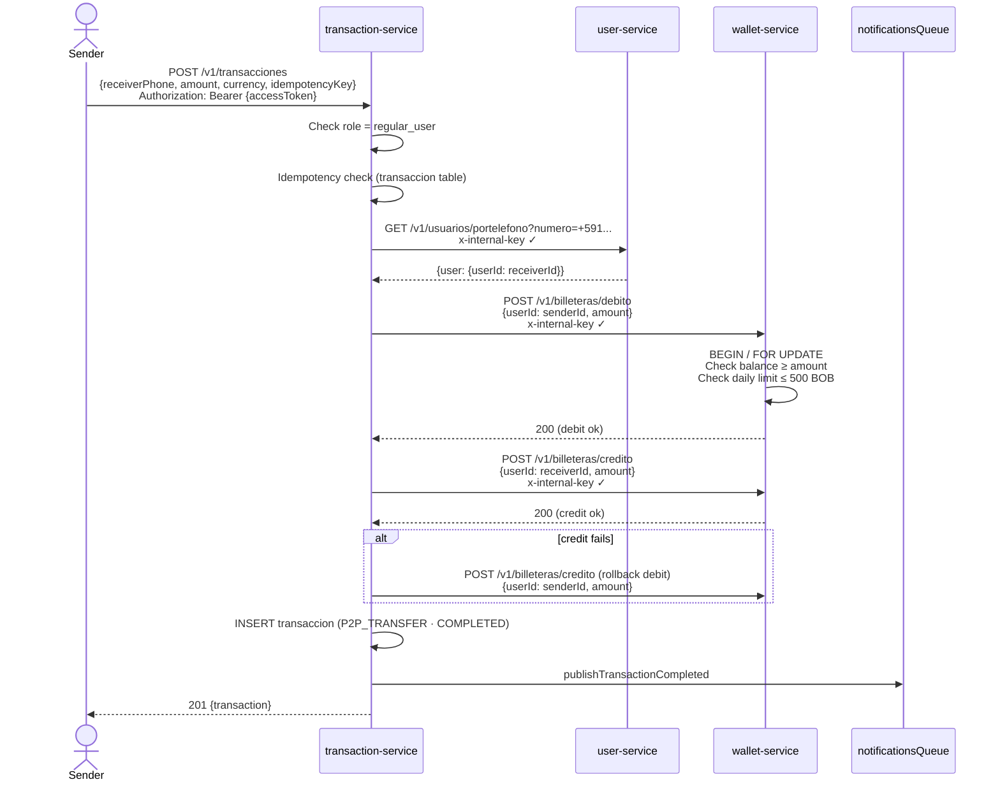
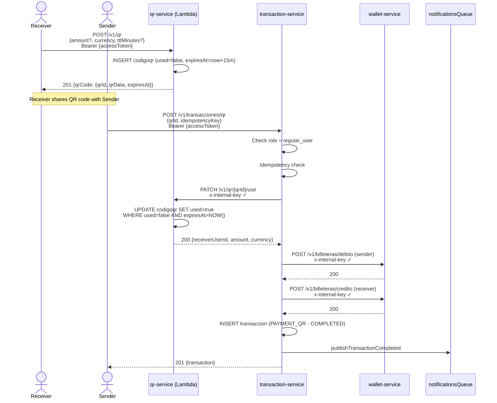
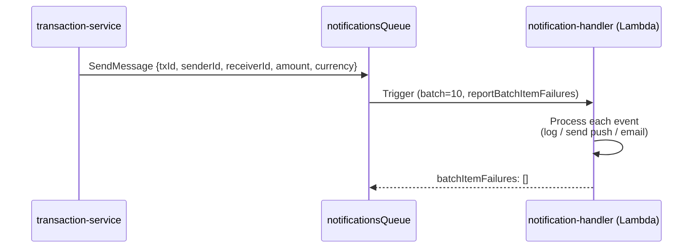
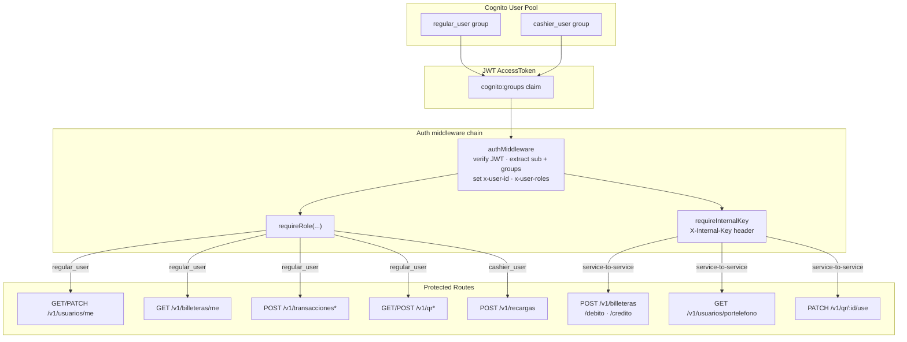
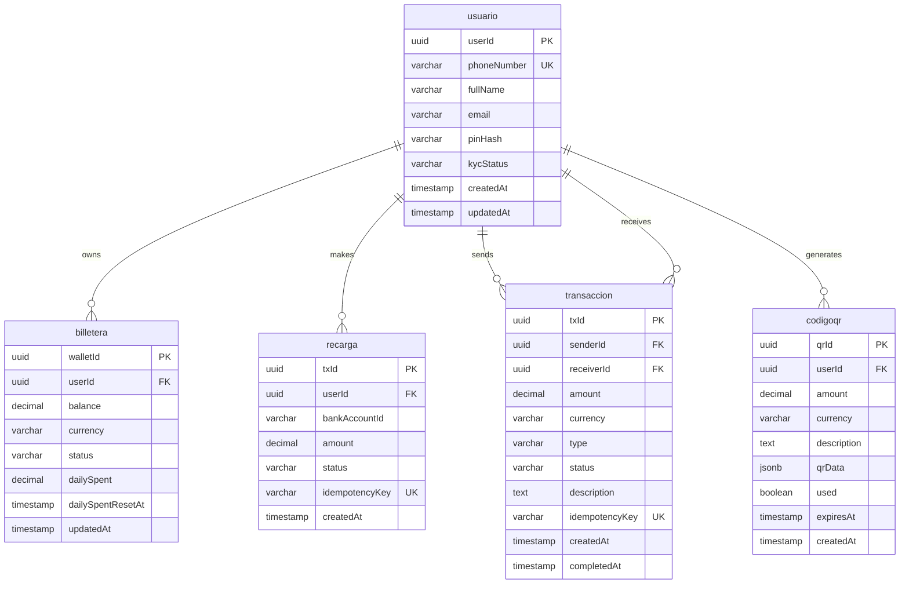
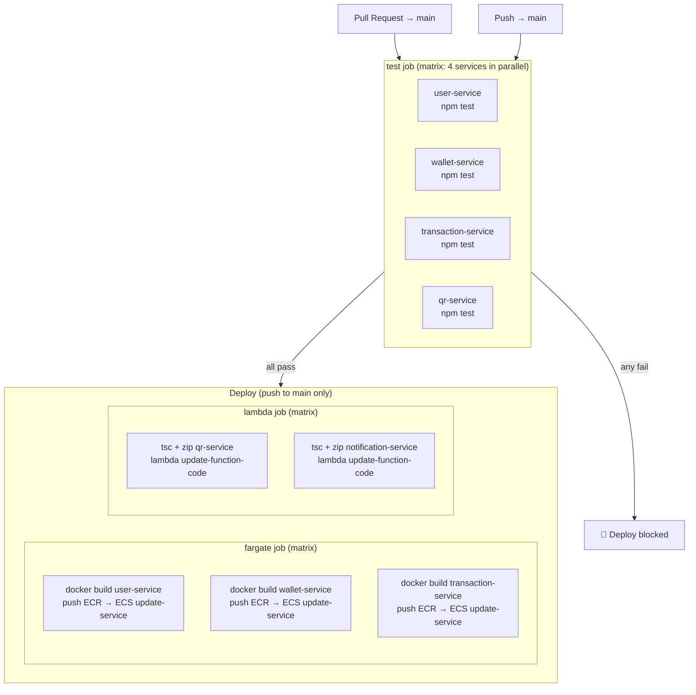

# YapePay — Architecture Diagrams

---

## 1. AWS Infrastructure

---

## 2. Service Communication Map

---

## 3. User Registration Flow

---

## 4. Login Flow

---

## 5. P2P Transfer Flow

---

## 6. QR Payment Flow

---

## 7. Notification Flow

---

## 8. Role-Based Access Control

---

## 9. Database Schema

---

## 10. CI/CD Pipeline

